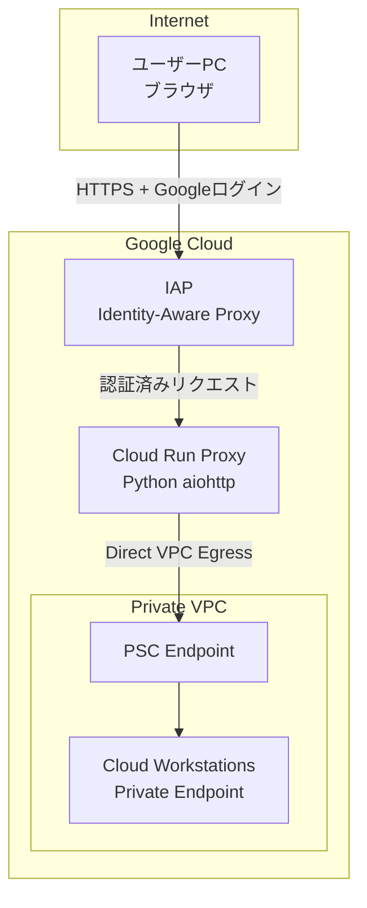

# Accessing Private Cloud Workstations via Cloud Run Proxy

Private設定のCloud Workstationsに、Cloud Runをプロキシサーバーとして経由してアクセスするための構成。

## アーキテクチャ



## フォルダ構成

| フォルダ | 説明 |
|----------|------|
| [workstations/](workstations/) | Cloud Workstations (Terraform) |
| [cloud-run-proxy/](cloud-run-proxy/) | Cloud Run プロキシサーバー (Terraform + Python) |

## デプロイ手順

### Step 1: API有効化

```bash
gcloud services enable \
  workstations.googleapis.com \
  run.googleapis.com \
  compute.googleapis.com \
  cloudbuild.googleapis.com \
  dns.googleapis.com \
  artifactregistry.googleapis.com \
  iap.googleapis.com \
  --project=YOUR_PROJECT_ID
```

### Step 2: Cloud Workstations デプロイ

[workstations/README.md](workstations/README.md) を参照。

### Step 3: Cloud Run Proxy デプロイ

[cloud-run-proxy/README.md](cloud-run-proxy/README.md) を参照。

### Step 4: 接続

```
# ブラウザで直接アクセス (Googleログイン)
https://SERVICE_URL/status/WORKSTATION_NAME
https://SERVICE_URL/ws/WORKSTATION_NAME/
```

## 制約事項

- Cloud Runの最大タイムアウトは60分
- 60分を超える接続は自動再接続が必要
- WebSocket対応済み（VS Code IDE完全動作）

## ライセンス

MIT
